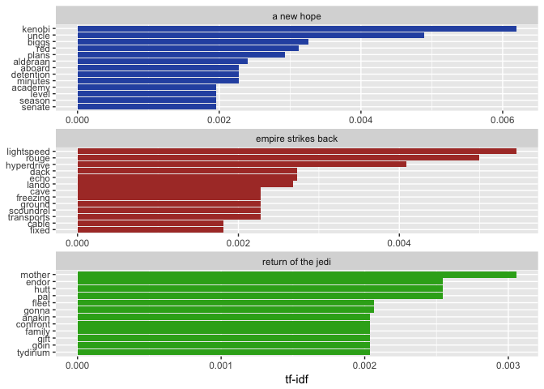
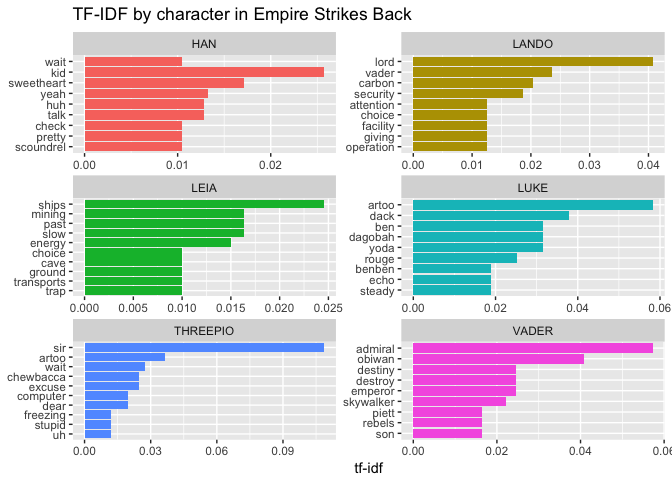
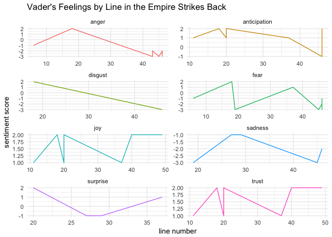
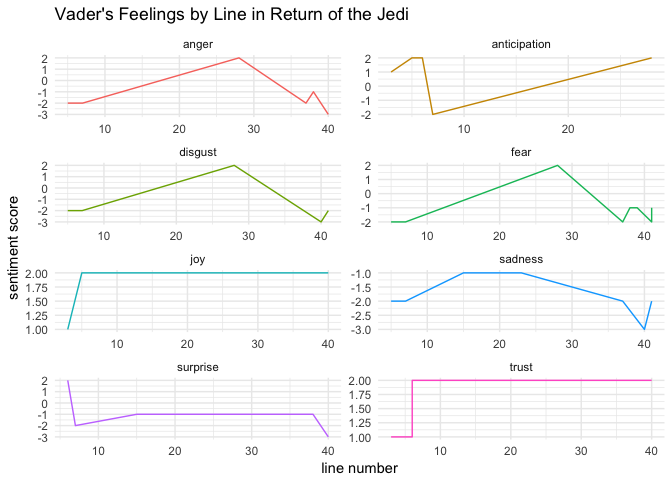

Star Wars Text Mining
================
Nick Lechner
June 17, 2018

Text Mining the Star Wars Original Trilogy movie scripts
========================================================

------------------------------------------------------------------------

### Importing the data

``` r
e4 = read.table("star-wars-movie-scripts/SW_EPISODEIV.txt", stringsAsFactors = F, header = TRUE, quote = "\"");
colnames(e4) = c('index','character','dialogue')
e4$movie = "a new hope"
e5 = read.table("star-wars-movie-scripts/SW_EPISODEV.txt", stringsAsFactors = F, header = TRUE, quote = "\"")
colnames(e5) = c('index','character','dialogue')
e5$movie = "empire strikes back"
e6 = read.table("star-wars-movie-scripts/SW_EPISODEVI.txt", stringsAsFactors = F, header = TRUE, quote = "\"")
colnames(e6) = c('index','character','dialogue')
e6$movie = "return of the jedi"
```

------------------------------------------------------------------------

### String Cleaning

``` r
remove_punctuation = function(df){
  df %>% 
    mutate(dialogue = str_replace_all(dialogue, "[[:punct:]]", "")) %>% 
    mutate(dialogue = tolower(str_replace_all(dialogue, " {2,}", " "))) %>%
    return()
}

create_tidy_text = function(df){
  df %>% 
    unnest_tokens("word", "dialogue") %>% 
    return()
}
```

``` r
star_wars = list(e4, e5, e6)
star_wars = lapply(star_wars, remove_punctuation)
star_wars = lapply(star_wars, create_tidy_text)
star_wars = do.call(rbind, star_wars)

stop_words_no_punct = stop_words %>% 
  mutate(word = str_replace_all(word, "[[:punct:]]", ""))

star_wars = star_wars %>% anti_join(stop_words_no_punct)
```

    ## Joining, by = "word"

``` r
head(star_wars)
```

    ##   index character      movie      word
    ## 1     1  THREEPIO a new hope      hear
    ## 2     1  THREEPIO a new hope      shut
    ## 3     1  THREEPIO a new hope      main
    ## 4     1  THREEPIO a new hope   reactor
    ## 5     1  THREEPIO a new hope destroyed
    ## 6     1  THREEPIO a new hope   madness

Term Frequency By Movie
-----------------------

``` r
star_wars_words = star_wars %>%
  count(movie, word, sort = TRUE) %>%
  ungroup()

star_wars_words %>% head(20)
```

    ## # A tibble: 20 x 3
    ##    movie               word         n
    ##    <chr>               <chr>    <int>
    ##  1 a new hope          luke        63
    ##  2 a new hope          sir         46
    ##  3 empire strikes back sir         38
    ##  4 return of the jedi  luke        37
    ##  5 return of the jedi  artoo       34
    ##  6 a new hope          ship        32
    ##  7 return of the jedi  chewie      29
    ##  8 return of the jedi  father      29
    ##  9 empire strikes back lord        28
    ## 10 empire strikes back artoo       27
    ## 11 return of the jedi  master      27
    ## 12 a new hope          red         26
    ## 13 a new hope          time        26
    ## 14 empire strikes back chewie      26
    ## 15 empire strikes back luke        25
    ## 16 empire strikes back vader       24
    ## 17 a new hope          force       22
    ## 18 a new hope          alderaan    20
    ## 19 a new hope          station     20
    ## 20 return of the jedi  shield      20

TF IDF by movie
---------------

Identifies words most unique to each movie

``` r
star_wars_tfidf = star_wars_words %>% 
  bind_tf_idf(word, movie, n) %>%
  arrange(desc(tf_idf))
star_wars_tfidf %>% head(20)
```

    ## # A tibble: 20 x 6
    ##    movie               word           n      tf   idf  tf_idf
    ##    <chr>               <chr>      <int>   <dbl> <dbl>   <dbl>
    ##  1 a new hope          kenobi        19 0.00563 1.10  0.00619
    ##  2 empire strikes back lightspeed    12 0.00496 1.10  0.00545
    ##  3 empire strikes back rouge         11 0.00455 1.10  0.00500
    ##  4 a new hope          uncle         15 0.00445 1.10  0.00489
    ##  5 empire strikes back hyperdrive     9 0.00372 1.10  0.00409
    ##  6 a new hope          biggs         10 0.00297 1.10  0.00326
    ##  7 a new hope          red           26 0.00771 0.405 0.00313
    ##  8 return of the jedi  mother         6 0.00278 1.10  0.00305
    ##  9 a new hope          plans          9 0.00267 1.10  0.00293
    ## 10 empire strikes back dack           6 0.00248 1.10  0.00273
    ## 11 empire strikes back echo           6 0.00248 1.10  0.00273
    ## 12 empire strikes back lando         16 0.00662 0.405 0.00268
    ## 13 return of the jedi  endor          5 0.00232 1.10  0.00255
    ## 14 return of the jedi  hutt           5 0.00232 1.10  0.00255
    ## 15 return of the jedi  pal            5 0.00232 1.10  0.00255
    ## 16 a new hope          alderaan      20 0.00593 0.405 0.00240
    ## 17 a new hope          aboard         7 0.00208 1.10  0.00228
    ## 18 a new hope          detention      7 0.00208 1.10  0.00228
    ## 19 a new hope          minutes        7 0.00208 1.10  0.00228
    ## 20 empire strikes back cave           5 0.00207 1.10  0.00227

``` r
 star_wars_tfidf %>% 
  mutate(word  = factor(word, levels = rev(unique(word)))) %>% 
  group_by(movie) %>%
  top_n(12) %>% 
  ggplot(aes(word, tf_idf, fill = movie)) + 
  scale_fill_manual(values = c('#2d54b0', '#ad3a32', '#32ab1d')) +
  geom_col(show.legend =  F) + 
  labs(x = NULL, y = "tf-idf") + 
  facet_wrap(~movie, nrow = 3, scales = "free") + 
  coord_flip()
```

    ## Selecting by tf_idf



TF IDF between the 6 main characters in The Empire Strikes Back
---------------------------------------------------------------

Which words are most unique to each character in Episode 5?

``` r
star_wars %>% 
  filter(movie == "empire strikes back") %>% 
  filter(character %in% c("HAN", "LUKE", "LEIA", "THREEPIO", "VADER", "LANDO")) %>% 
  count(character, word, sort = TRUE) %>% 
  bind_tf_idf(word, character, n) %>%
  arrange(desc(tf_idf)) %>% 
  mutate(word  = factor(word, levels = rev(unique(word)))) %>% 
  group_by(character) %>%
  top_n(8) %>% 
  ggplot(aes(word, tf_idf, fill = character)) + 
  geom_col(show.legend =  F) + 
  labs(x = NULL, y = "tf-idf") + 
  facet_wrap(~character, ncol = 2, scales = "free") + 
  coord_flip() + 
  ggtitle("TF-IDF by character in Empire Strikes Back")
```

    ## Selecting by tf_idf



Sentiment Analysis of Darth Vader's Lines in Return of the Jedi
---------------------------------------------------------------

How do Vader's emotions change throughout his lines in return of the Jedi?

``` r
vader_e5 = e5 %>% 
  remove_punctuation() %>% 
  filter(character == "VADER") %>% 
  mutate(index = row_number()) %>% 
  unnest_tokens("word", "dialogue") %>% 
  anti_join(stop_words_no_punct) %>% 
  inner_join(get_sentiments('nrc')) %>% 
  inner_join(get_sentiments("afinn")) %>% 
  count(index, word, sentiment, score) %>% 
  filter(!(sentiment %in% c('positive', 'negative'))) %>%
  ggplot(aes(index, n*score)) + 
  facet_wrap(~sentiment, scales = "free", ncol = 2) + 
  geom_line(aes(color = as.factor(sentiment))) +
  theme_minimal() + 
  theme(legend.position = "none") + 
  ggtitle("Vader's Feelings by Line in the Empire Strikes Back") + 
  labs(x = "line number", y = "sentiment score")
```

    ## Joining, by = "word"
    ## Joining, by = "word"
    ## Joining, by = "word"

``` r
vader_e6 = e6 %>% 
  remove_punctuation() %>% 
  filter(character == "VADER") %>% 
  mutate(index = row_number()) %>% 
  unnest_tokens("word", "dialogue") %>% 
  anti_join(stop_words_no_punct) %>% 
  inner_join(get_sentiments('nrc')) %>% 
  inner_join(get_sentiments("afinn")) %>% 
  count(index, word, sentiment, score) %>% 
  filter(!(sentiment %in% c('positive', 'negative'))) %>%
  ggplot(aes(index, n*score)) + 
  facet_wrap(~sentiment, scales = "free", ncol = 2) + 
  geom_line(aes(color = as.factor(sentiment))) +
  theme_minimal() + 
  theme(legend.position = "none") + 
  ggtitle("Vader's Feelings by Line in Return of the Jedi") + 
  labs(x = "line number", y = "sentiment score")
```

    ## Joining, by = "word"
    ## Joining, by = "word"
    ## Joining, by = "word"

``` r
vader_e5; vader_e6
```


